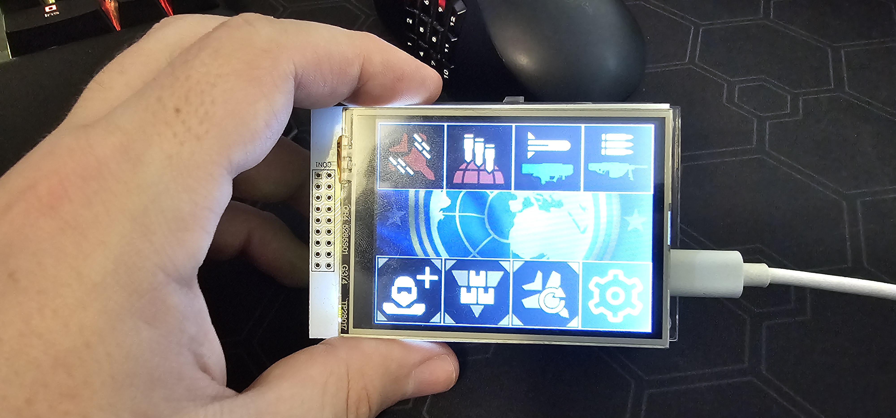

# Macro Pad

This project is for the macro pad being developed by Scott Cashman. Based on the Arduino R4 and ILI9341 displays.

## Usage

### Home screen

Displays your active macros for selection. There are currently 7 active macros available at a time.


### Select macro screen

Displays all possible macros as defined in the macros.csv file. Select your desired macro and then press "Place".


### Macro placement screen

Shows all available slots, select the location you want to place your macro then press "Done".


This will update your active macros so your home screen would now look like this.



## Easy setup

For the simplest setup, use an Arduino R4 Minima and ili9341 TFT touchscreen shield. Tested with the IDUINO 2.8" TFT from Altronics. Any micro SD card should suffice, just format to FAT32 and add the files under "sd_example".

I suggest using the Arduino IDE to install the program and calibrate your touch screen.

Non-affiliate links for purchase in AUS:

Arduino:
- https://www.altronics.com.au/p/z6240a-funduino-uno-r4-compatible-development-board/
- https://www.jaycar.com.au/arduino-uno-rev4-minima-development-board/p/XC9210

TFT:
- https://www.altronics.com.au/p/z6510a-2.8-inch-tft-touch-shield-with-touch-screen/

## Touch screen calibration

Calibration can be performed by following the steps below.
1. Uncomment `#define TOUCH_CALIBRATION_PROCESS` in [touchscreen_calibration.h](https://github.com/sccashma/macro-pad/blob/6-no-examples-for-setting-up-the-sd-card/src/touchscreen_calibration.h#L16) and uploading the program.
2. Open the serial monitor and set the baud to 115200.
3. Using a stylus, press on the white corners one at a time.
4. Find the min and max x and y values printed to the screen and replace the values for `X_o`, `X_n`, `Y_o`, and `Y_n` in [touchscreen_calibration.h](https://github.com/sccashma/macro-pad/blob/6-no-examples-for-setting-up-the-sd-card/src/touchscreen_calibration.h#L35-L36)

## Macro definitions

The macros are stored in the "/macros.csv" file in the root of the SD card. The first line is the headers which can be anything you want (it's ignored). Each entry MUST have a unique id and MUST be between 0 and 65534.

Example macro.csv

```txt
id,	display name,	            bmp,	        macro
0,	A_FLAM-40_Flame_Sentry,     A_FLA039.bmp,	DOWN,UP,RIGHT,DOWN,UP,UP
1,	AM-23_EMS_Mortar_Sentry,    AM-23040.bmp,	DOWN,UP,RIGHT,DOWN,RIGHT
2,	Anti-Materiel_Rifle,        ANTI-041.bmp,	DOWN,LEFT,RIGHT,UP,DOWN
3,	Anti-Personnel_Minefield,   ANTI-042.bmp,	DOWN,LEFT,UP,RIGHT
4,	Arc_Thrower,                ARC_T043.bmp,	DOWN,RIGHT,DOWN,UP,LEFT,LEFT
5,	Autocannon,                 AUTOC045.bmp,	DOWN,LEFT,DOWN,UP,UP,RIGHT
6,	Autocannon_Sentry,          AUTOC044.bmp,	DOWN,UP,RIGHT,UP,LEFT,UP
7,	Ballistic_Shield_Backpack,  BALLI046.bmp,	DOWN,LEFT,DOWN,DOWN,UP,LEFT
8,	Commando,                   COMMA047.bmp,	DOWN,LEFT,UP,DOWN,RIGHT
```

**LIMITATION:** Due to some current performance optimisations, it's possible to freeze the device if there are too many macros defined, or macros too long.

## Background image

The background image must be a 24-bit bitmap. To fill the screen, it should be 240x320 in size. Call this image "bckgrnd.bmp" and place it in the root of the sd.

## Icons

Icons should be 80x80 24-bit bitmap images. They must be stored in the "/icons/" directory. 
Names must not exceed 8 characters in lenght (excluding the extension ".bmp").

The "menu.bmp" image for the settings button should be placed in the icons directory also.
